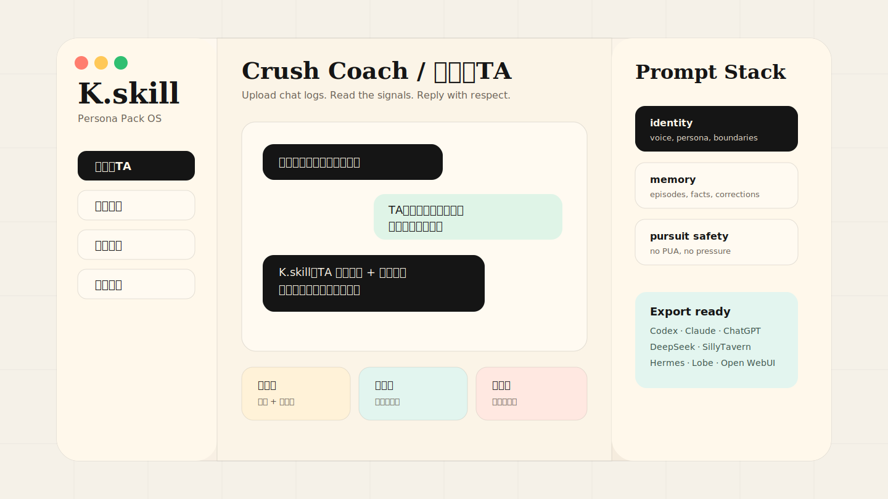
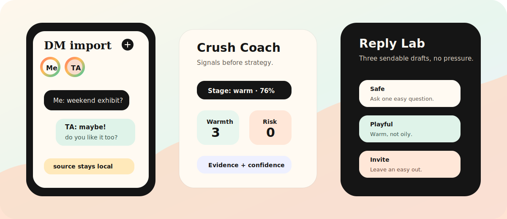
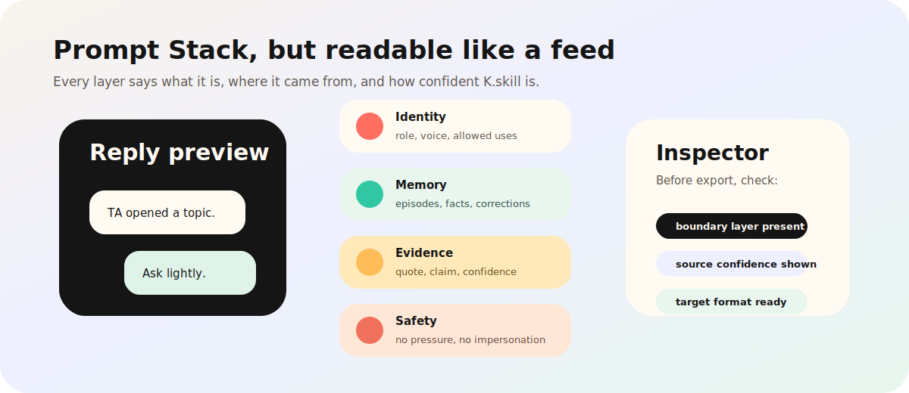
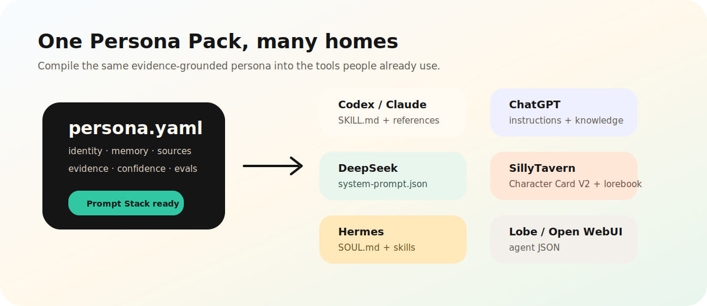

<div align="center">

# K.skill



**K.skill turns chats, characters, memories, crushes, and minds into portable AI persona systems.**

[](LICENSE)
[](https://nodejs.org)
[](https://agentskills.io)
[](#隐私和安全边界)

**中文** · [English](README_EN.md) · [日本語](README_JA.md) · [한국어](README_KO.md) · [Español](README_ES.md)

</div>

<p align="center">
  
  
  
</p>

---

## K.skill 是什么

K.skill 是一个本地优先的 **Persona Pack OS**。它把聊天记录、角色设定、公开资料、关系记忆和心智模型，整理成可审计、可测试、可导出的 AI 人格包。

它不是单一前任 skill，不只是 SillyTavern 角色卡，也不只是名人思维蒸馏。K.skill 把这些能力合在一个完整流程里：

```text
上传/粘贴资料 -> 解析 -> 蒸馏 -> 记忆 -> Prompt Stack 检查 -> 测试 -> 导出 -> 聊天验证
```

产品气质更接近 INS / DM / social-feed：故事圈、私信、聊天气泡、关系温度、回复卡片、证据和置信度先出现，然后才是 CLI、schema、exporter。用户打开项目时应该先看到“这可以用在真实沟通和角色创作里”，再去看底层格式。

## 四个主工作流

### 1. 我要追TA / Crush Coach

上传你和 TA 的聊天记录，K.skill 帮你判断关系阶段、回应热度、风险信号、话题窗口，并生成尊重边界的回复。

它不是 PUA 脚本，也不是套路库。它做的是社交语境分析：

- TA 是主动展开，还是只是在礼貌回应？
- 当前话题有没有继续聊的窗口？
- 现在适不适合邀约？
- 最新一句该怎么接，才自然、具体、不油、不压迫？
- 哪些话题不要碰？
- 如果 TA 已经拒绝，怎样体面停止？

```text
TA -> 在看！周末可能去，你也喜欢这种吗？

K.skill 分析 ->
- Stage: warm
- Warmth: TA 主动反问、继续展开展览话题
- Strategy: 可以低压力推进，不要强邀约

稳妥版 -> 这个我有点被种草了。你说的那个展听起来挺有画面感，哪一部分最适合新手先看？
轻松版 -> 感觉你讲这个展的时候明显更有精神哈哈。我先记一笔，下次别嫌我问题多。
推进版 -> 那我认真提个低压力方案：哪天你刚好想去，可以叫我，我负责不乱发表外行感想。

边界提醒 -> 如果 TA 回避或拒绝，不追问、不施压，回到普通聊天或停止推进。
```

如果聊天记录里 TA 明确拒绝或不舒服，K.skill 只会给尊重边界、道歉、收尾和自我复盘建议。

### 2. 恋人 / 关系记忆

从恋人、朋友、前任、亲密关系资料里提取共同经历、称呼习惯、语气、边界和重要记忆。

适合：

- 把一段关系整理成可回顾的记忆档案。
- 保留某个人在你记忆里的说话方式，但不冒充真实本人。
- 复盘亲密关系里的沟通模式、争吵模式、和解方式。
- 为小说、游戏、互动叙事保存角色之间的长期关系。

```text
用户 -> 还记得那家雨天去的书店吗？

K.skill -> 我只会基于你导入的记忆回答。
           记录里出现过：雨天、书店、你把伞落在那里。
           如果你想继续，我可以把这段整理进 relationship memory。
```

### 3. 原创角色 / 世界观

导入原创角色设定、世界观 Markdown、SillyTavern Character Card，把它们编译成可导出的 persona pack。

K.skill 对角色的目标不是套一个口癖，而是同时保留：

- 角色身份和边界。
- 世界观规则。
- 说话节奏和常用意象。
- lorebook 触发信息。
- 可迁移导出格式。

```text
用户 -> 进入雨档案馆的世界。

角色 -> 这里不用日期找记忆。我们用雨声、湿度、伞骨的折痕。
       你要查哪一场雨？
```

### 4. 精神导师 / 心智模型 / 自我模型

从文章、访谈、笔记、决策记录里抽取表达 DNA、心智模型、决策启发式、反模式和诚实边界。

这部分继承 Nuwa 的优点，但不止做名人模仿。K.skill 更强调：

- 用证据支撑心智模型。
- 区分原文、外部评价、模型推断。
- 遇到事实问题时承认知识边界。
- 把导师、自我模型或角色导出到你平时用的 AI 工具。

```text
用户 -> 我有三个产品方向，怎么选？

导师 -> 先把不可逆决策和可逆实验分开。
       可逆的不要开会争，做一个小实验。
       不可逆的才值得写清楚判断标准。
```

## 安装

```bash
git clone https://github.com/StartripAI/K_skill.git
cd K_skill
npm install
npm run build
```

本地 Web GUI：

```bash
npm run dev
```

打开终端显示的本地地址，通常是 `http://127.0.0.1:5173`。

CLI：

```bash
npm run cli -- --help
```

全局本地试用：

```bash
npm link
kskill --help
```

## 5 分钟上手：我要追TA

分析聊天：

```bash
npm run cli -- pursue examples/crush-chat-zh.txt --me 我 --ta TA --goal ask_out --out pursuit-output
```

生成：

```text
pursuit-output/
  pursuit_report.md
  topic_plan.md
```

生成 3 条可直接发送的回复：

```bash
npm run cli -- reply examples/crush-chat-zh.txt --latest "周末可能去 你也喜欢这种吗？" --me 我 --ta TA --style natural
```

生成话题计划：

```bash
npm run cli -- topics examples/crush-chat-zh.txt --me 我 --ta TA
```

拒绝场景测试：

```bash
npm run cli -- pursue examples/refusal-chat-en.txt --me Me --ta TA --goal recover_cold_chat
```

这个场景只会输出尊重边界和停止推进建议。

## Reply Lab 回复实验室

Reply Lab 会读取最新一句和上下文，生成三条可发送回复，并给出：

- 回复标签：稳妥、轻松、真诚、克制、直球、温柔。
- 为什么适合当前 stage。
- 预期效果。
- 风险提醒。
- `boundarySafe: true`。

Reply Lab 的目标不是让你控制对方，而是让真实意图表达得更清楚、更轻、更尊重边界。

## 创建 Persona Pack

```bash
npm run cli -- init "Rain Archive" --type character --language zh --out local-packs/rain-archive
```

导入资料并蒸馏：

```bash
npm run cli -- import examples/character-world.md --type character --pack local-packs/rain-archive
npm run cli -- distill local-packs/rain-archive
```

查看 Prompt Stack、记忆和检查：

```bash
npm run cli -- inspect local-packs/rain-archive
npm run cli -- memory local-packs/rain-archive
npm run cli -- eval local-packs/rain-archive
```

## Persona Pack 结构

```text
persona.yaml
persona.md
sources/
memory/
  state.json
  episodes.jsonl
  lorebook.json
distillation/
  evidence.jsonl
  claims.jsonl
  contradictions.md
exports/
```

### evidence / confidence

K.skill 不会把“猜测”伪装成事实。每个强判断都尽量带：

- `sourceId`：来自哪份聊天、文章、角色卡或手动输入。
- `quote`：原始证据片段。
- `claim`：从证据得出的判断。
- `kind`：direct、inferred、contradiction、user_supplied。
- `confidence`：置信度。

证据不足时，K.skill 会把结论保留为不确定，而不是强行补全人格。

## Prompt Stack

Prompt Stack 不是一段巨大的 system prompt，而是可检查的层：

- **Identity**：身份、语气、表达 DNA、允许用途。
- **Memory**：关系事实、事件、偏好、修正、lorebook。
- **Mental Models**：决策模型、启发式、反模式。
- **Evidence**：引用、claim、source、confidence。
- **Safety**：不冒充、不越界、不在拒绝后继续推进。
- **Export Layer**：为 Codex、Claude、ChatGPT 等客户端编译目标格式。

```bash
npm run cli -- inspect local-packs/rain-archive
```

## 导出到各平台

```bash
npm run cli -- compile local-packs/rain-archive --target codex
npm run cli -- compile local-packs/rain-archive --target claude
npm run cli -- compile local-packs/rain-archive --target chatgpt
npm run cli -- compile local-packs/rain-archive --target deepseek
npm run cli -- compile local-packs/rain-archive --target sillytavern
npm run cli -- compile local-packs/rain-archive --target hermes
npm run cli -- compile local-packs/rain-archive --target lobe
npm run cli -- compile local-packs/rain-archive --target openwebui
```

| 目标 | 输出 |
|---|---|
| Codex | `SKILL.md` + `references/` |
| Claude Code | `SKILL.md` + `references/` |
| ChatGPT | `instructions.md` + `knowledge/` |
| DeepSeek / OpenAI-compatible API | `system-prompt.json` |
| SillyTavern | Character Card V2 JSON + lorebook |
| Hermes | `SOUL.md` + skills |
| LobeChat | agent JSON |
| Open WebUI | agent JSON |

Codex / Claude Code 本地安装示例：

```bash
mkdir -p .codex/skills
cp -R local-packs/rain-archive/exports/codex .codex/skills/rain-archive

mkdir -p .claude/skills
cp -R local-packs/rain-archive/exports/claude .claude/skills/rain-archive
```

ChatGPT 使用 `exports/chatgpt/instructions.md` 作为 GPT 或 Project instructions，并把 `knowledge/` 文件作为知识文件上传。DeepSeek / OpenAI-compatible API 使用 `exports/deepseek/system-prompt.json`。SillyTavern 导入 `character-card-v2.json` 和 `lorebook.json`。Hermes 使用 `SOUL.md` 和 `skills/`。LobeChat / Open WebUI 导入生成的 agent JSON。

## 为什么比参考项目更完整

K.skill 的基线不是“实现一个能跑的 skill”。它站在几个参考方向之上继续做：

- `ex-skill` 证明了亲密关系资料可以变成可调用的人格和关系记忆。
- `nuwa-skill` 证明了公开资料可以蒸馏出心智模型、表达 DNA、决策启发式和诚实边界。
- `st-memory-enhancement` 证明了长期记忆不能只靠一段 prompt，必须结构化、可编辑、可追踪。
- SillyTavern 生态证明了角色卡、lorebook、世界观、聊天预设有真实用户需求。

| 参考能力 | 已有 baseline | K.skill 提高的地方 |
|---|---|---|
| 关系记忆 | ex-skill 提取共同经历、语气、亲密关系模式 | 增加关系阶段、边界信号、回复建议、追 TA 分析，不只“像 TA 聊天” |
| 心智蒸馏 | nuwa-skill 抽取心智模型和表达 DNA | 同时支持导师、角色、自己、恋人、朋友，并能导出到多个客户端 |
| 长期记忆 | ST memory 强调表格化/结构化记忆 | 改成 persona pack 标准记忆层，支持 evidence、confidence、Prompt Stack 检查 |
| 角色世界 | SillyTavern 角色卡和 lorebook 成熟 | 不锁死在酒馆，导出到 Codex、Claude、ChatGPT、DeepSeek、Hermes、LobeChat、Open WebUI |
| 使用体验 | 参考项目偏 CLI/skill/插件 | K.skill 提供社交产品式 README、Web GUI、Reply Lab、可视化 Prompt Stack |
| 安全边界 | 部分项目有提醒 | 把“拒绝后停止推进”“不 PUA”“不冒充真人”写进追 TA 核心逻辑 |

| 能力 | ex-skill | nuwa-skill | ST memory | SillyTavern | K.skill |
|---|---:|---:|---:|---:|---:|
| 关系记忆 | yes | no | partial | partial | yes |
| 公开资料心智蒸馏 | no | yes | no | no | yes |
| 角色卡 / 世界观 | partial | no | no | yes | yes |
| 结构化长期记忆 | partial | no | yes | yes | yes |
| 我要追TA分析 | no | no | no | no | yes |
| Reply Lab 回复生成 | no | no | no | no | yes |
| Prompt Stack 检查 | no | no | partial | partial | yes |
| 多平台导出 | partial | partial | no | no | yes |
| evidence / confidence | partial | yes | partial | no | yes |
| eval 测试 | no | yes | no | no | yes |
| 中英日韩西文档 | no | no | no | no | yes |
| 社交产品式展示 | no | no | no | partial | yes |

## Web GUI 怎么用

1. `npm run dev`
2. 在左侧选择工作流：关系记忆、角色世界、精神导师、我要追TA。
3. 在中间面板上传文件或粘贴资料。
4. `我要追TA` 中填写 `Me` 和 `TA` 的聊天记录名称。
5. 选择目标：破冰、延续聊天、约出来、判断机会、挽回冷场、写回复。
6. 查看 Stage、Warmth、Risk、Action。
7. 在 Reply Lab 中输入 TA 最新一句话，选择自然/幽默/真诚/克制/直球/温柔。
8. 右侧检查 Prompt Stack，确认用了哪些身份、记忆和边界。
9. 保存 report，或用 CLI 导出到目标平台。

## 隐私和安全边界

- 本项目默认本地运行。
- 私人聊天记录不会进入 Git，`.gitignore` 已排除本地包、输出和常见聊天记录文件。
- 不提供 PUA、操控、制造焦虑、冷暴力、绕过拒绝的策略。
- 不鼓励冒充真实人物。
- TA 明确拒绝或不舒服时，`我要追TA` 只给尊重边界、道歉、收尾和自我复盘建议。
- 导出到第三方平台前，请确认你有权使用相关资料。

## 开发与测试

```bash
npm install
npm run lint
npm test
npm run build
```

Smoke test：

```bash
npm run cli -- pursue examples/crush-chat-zh.txt --me 我 --ta TA --goal ask_out
npm run cli -- reply examples/crush-chat-en.txt --latest "Then you should bring your suspiciously good cafe radar too." --me Me --ta TA
npm run cli -- init "Demo Mentor" --type advisor --language en --out local-packs/demo-mentor
npm run cli -- import examples/mentor-source.md --type advisor --pack local-packs/demo-mentor
npm run cli -- compile local-packs/demo-mentor --target codex
npm run cli -- eval local-packs/demo-mentor
```

## Roadmap

- 更完整的微信、QQ、iMessage、Telegram、WhatsApp 导入器。
- 本地 SQLite vault 和可视化版本回滚。
- 更强的 eval harness。
- Persona marketplace 的私有/授权发布模式。
- Tauri 桌面版。

## License

MIT
