<div align="center">

# K.skill

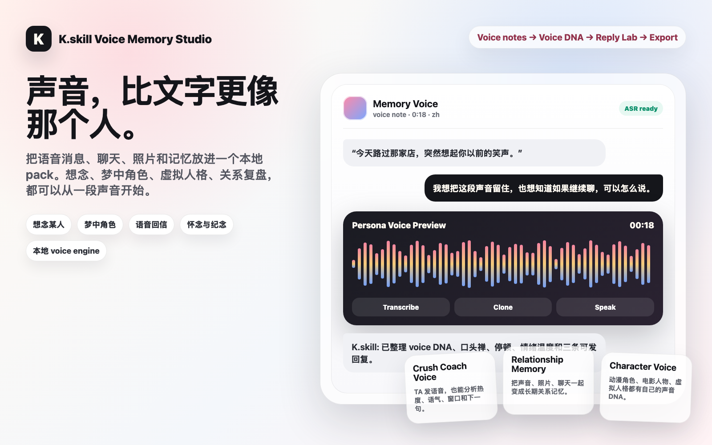

**음성, 채팅, 캐릭터, 관계 기억, Life Mentor를 쓸 수 있는 AI persona pack으로 만드는 로컬 인격 워크벤치.**  
**Local voice + persona workbench for chats, characters, relationship memory, and Life Mentor packs.**

[中文](README.md) · [English](README_EN.md) · [日本語](README_JA.md) · **한국어** · [Español](README_ES.md)

</div>

K.skill은 local-first 인격 워크벤치입니다. 채팅 로그, 관계 자료, 2D OC, Movie Character, Virtual Persona, 세계관, 공개 글, 개인 원칙을 검사 가능하고 테스트 가능하며 내보낼 수 있는 persona pack으로 바꿉니다. GUI에서는 업로드, 파싱, 리포트, Reply Lab, 다운로드를 처리하고, CLI에서는 같은 pack을 Codex, Claude, ChatGPT, DeepSeek, SillyTavern, Hermes, LobeChat, Open WebUI로 compile / export합니다.

여기에 적힌 기능은 실제 명령, 예제 입력, 생성 파일, 릴리스 검사를 갖습니다.

## Main Hook: Voice Memory


텍스트도 중요하지만, 목소리는 더 빠르게 닿습니다. 잠깐의 쉼, 웃음, 말버릇, 속도, 감정 온도는 긴 메모보다 더 “그 사람 같다”는 느낌을 줍니다.

K.skill은 voice를 persona source로 다룹니다.

| Moment | 넣는 자료 | K.skill 결과 |
|---|---|---|
| 누군가가 그리울 때 | voice note, chats, photos, shared memories | voice DNA, relationship memory, chat rhythm, usable persona pack |
| 꿈속의 캐릭터 | description, character image, line audio, world notes | 목소리 감각이 있는 original character |
| 기억과 추억 | old chats, voice clips, screenshots, timeline | 읽고, 듣고, export할 수 있는 memory pack |
| Crush Coach Voice | TA voice note + recent chat | ASR transcript, tone read, warmth signals, 3 reply drafts |
| Virtual / Movie Character | character art, dialogue, voice reference, scene cards | voice profile, visual style, sticker intents, export bundle |

실제로 도는 명령:

```bash
npm run cli -- transcribe tests/fixtures/media/voice-note-en.wav --provider stub-asr --language en --out tmp/transcript.json
npm run cli -- import tests/fixtures/media/voice-note-en.wav --type pursuit --media --provider stub-asr --pack local-packs/voice-crush
npm run cli -- speak local-packs/voice-crush --text "Keep it light and natural." --provider stub-tts --out tmp/voice-preview.wav

KSKILL_LOCAL_TTS_COMMAND="node examples/local-voice-engine.mjs" \
  npm run cli -- speak local-packs/voice-crush \
  --text "I still remember how you said that." \
  --provider local-voice-clone \
  --reference-audio tests/fixtures/media/voice-note-en.wav \
  --out tmp/memory-voice.wav
```

`local-voice-clone`은 `text`, `voice`, `language`, `referenceAudioPath`, `voiceProfilePath`, `outFile`을 stdin JSON으로 로컬 voice engine에 전달합니다. engine이 `outFile`에 음성을 쓰고, K.skill이 GUI, CLI, export로 가져옵니다.

## 먼저 6개 장면

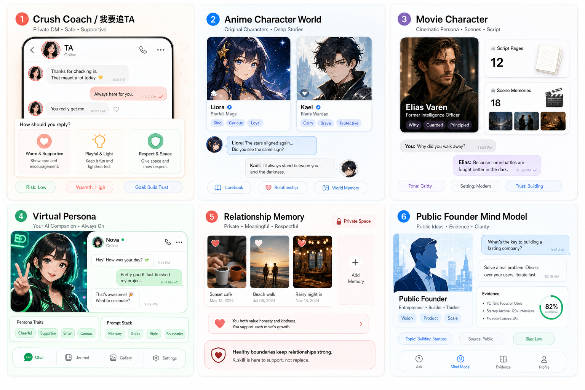

K.skill은 단순한 채팅창 하나가 아닙니다.

| Scene | 넣는 자료 | K.skill 결과 |
|---|---|---|
| Crush Coach | TA와의 채팅 | social signals, 다음 행동, 바로 보낼 3개 답장 |
| Relationship Memory | 채팅, 공유 기억, 보정 메모 | 장기 문맥 관계 memory pack |
| Anime Character | OC 설정, 세계관, 대사 샘플 | character identity, voice, lorebook |
| Movie Character | script fragments, scene cards, biography | arc와 scene memory가 있는 영화풍 persona |
| Virtual Persona | AI companion brief, avatar notes, NPC design | 안정적으로 대화되는 original persona |
| Public-Figure Life Mentor | articles, interviews, launches, notes | 공개 자료 기반 thinking model |

예를 들어 공개 창업자 자료를 모으면 product judgment, writing, tradeoffs, launch thinking을 같이 물어볼 수 있는 Life Mentor로 쓸 수 있습니다.

## DM 장면부터 보기

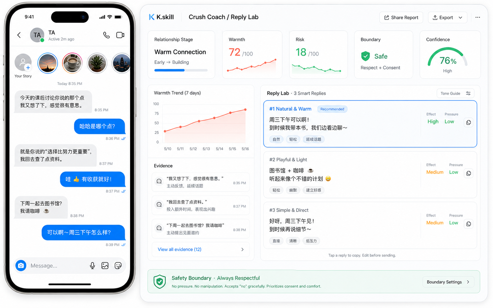

TA가 메시지를 보냈고, 이어가야 할지, 기다려야 할지, 약속을 제안해도 되는지, 주제를 바꿔야 할지 모를 때가 있습니다. Crush Coach는 대화를 사회적 신호로 읽고, 더 자연스러운 다음 문장을 제안합니다.

```text
TA: Maybe this weekend. Do you like this kind of exhibition too?

K.skill:
- relationship stage: warm
- warmth: TA가 질문을 돌려주고 전시 주제를 열어 둠
- risk: 아직 가볍게 이어가는 톤이 어울림
- evidence: question, interest topic, relaxed tone
- confidence: 0.76
- rhythm: 답장은 가볍게, 대화에 여지를 남김

Reply Lab:
Safe: That actually made me curious. Which part would you recommend for someone going in fresh?
Light: You sound way more animated when you talk about this exhibit. I am taking notes, promise not to ask too many beginner questions.
Slightly forward: Low-pressure idea: if you feel like going one day, call me. I will keep my amateur commentary under control.
```

분위기가 식으면 K.skill은 깔끔하게 마무리하거나, 잠시 멈추거나, 더 가벼운 주제로 돌아가는 쪽을 제안합니다.

## 네 가지 제품 워크플로

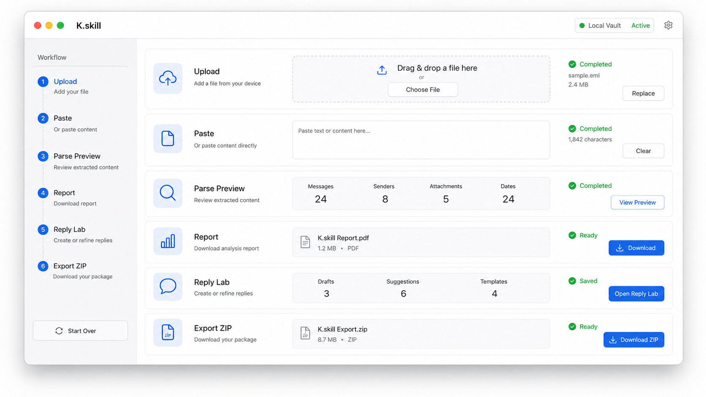

| Workflow | 대상 | 입력 | 출력 | 사용 시점 |
|---|---|---|---|---|
| **Crush Coach** | TA와 자연스럽게 소통하고 싶은 사람 | WeChat, QQ, iMessage, Telegram, WhatsApp, pasted chat logs | `pursuit_report.md`, `topic_plan.md`, 3개 reply, send-or-not 판단 | 답장, 초대, 대기 판단이 어려울 때 |
| **Relationship Memory** | 연인, 친구, 전 연인, 친밀한 관계 자료를 정리하는 사람 | 채팅, 공유 기억, 보정 메모 | 관계 기억, 호칭 패턴, 공유 에피소드, tone notes, exportable persona pack | 관계 복기, 장기 문맥, 글쓰기, 인터랙티브 스토리 |
| **Character World** | OC 작가, 2D 캐릭터 사용자, 롤플레이, 게임/영화 창작자 | Markdown 설정, character card, lorebook, Movie Character notes | 캐릭터 정체성, 세계 규칙, Prompt Stack, SillyTavern card, lorebook | 말버릇이 아니라 기억과 세계 규칙이 필요할 때 |
| **Life Mentor** | 공개 글과 개인 원칙을 대화형 사고 모델로 만들고 싶은 사람 | articles, interviews, public notes, decision records, personal principles | mental models, heuristics, anti-patterns, evidence, confidence, honesty notes | 의사결정, 회고, 개인 OS, 사고 보조 |

목적에 맞는 입구를 고르면 됩니다.

- **Crush Coach**는 답장, 타이밍, 자연스러운 대화 진행에 씁니다.
- **Relationship Memory**는 공유 기억, 관계의 분위기, 장기 문맥에 씁니다.
- **Character World**는 anime OC, fictional roles, Movie Character, lorebooks, roleplay cards에 씁니다.
- **Life Mentor**는 공개 자료와 개인 메모를 사고 모델로 바꿉니다.

## Voice Studio

K.skill은 이제 텍스트만 다루지 않습니다. 하나의 intake에서 **voice note**, 녹음, screenshot, image 파일, sticker, emoji 메모, PDF, video transcript, mixed ZIP을 받을 수 있습니다.  
먼저 **multimodal import**를 실행합니다. 텍스트는 chat turns가 되고, 음성은 **ASR**로 transcript evidence가 되며, image / screenshot / PDF / video transcript는 media evidence가 되고, sticker는 **sticker intents**로 정리됩니다. Crush Coach, Relationship Memory, Character World, Life Mentor가 같은 evidence trail을 이어서 씁니다.

CLI:

```bash
npm run cli -- transcribe tests/fixtures/media/voice-note-en.wav --provider stub-asr --language en --out tmp/transcript.json
npm run cli -- import tests/fixtures/media/voice-note-en.wav --type pursuit --media --provider stub-asr --pack local-packs/voice-crush
npm run cli -- speak local-packs/voice-crush --text "Keep it light and natural." --provider stub-tts --out tmp/voice-preview.wav
npm run cli -- voice-profile local-packs/voice-crush
```

GUI:

1. `DM intake`에서 `Files / Paste / Record / Media`를 선택합니다.
2. chat log, voice note, screenshot, sticker, PDF, video transcript, ZIP을 업로드합니다.
3. `Record`로 짧은 voice note를 녹음하고 ASR 후 Reply Lab에 넣습니다.
4. `Parse preview`는 message, asset, transcript, reaction, attachment kind를 보여줍니다.
5. `Persona Voice`는 voice DNA, TTS preview, visual style, sticker intents를 export에 같이 넣습니다.

## Crush Coach


Crush Coach는 “이 메시지를 어떻게 답장하지?”에서 시작할 때 쓰는 입구입니다. relationship stage, warmth signals, risk signals, topic windows, date readiness, chat rhythm을 분석합니다.

GUI:

1. `npm run dev` 또는 `npm run cli -- serve --port 5999`로 로컬 GUI를 시작합니다.
2. `Crush Coach`를 선택합니다.
3. 채팅 로그를 업로드하거나 최신 대화를 붙여넣습니다.
4. `me`와 `TA`의 speaker name을 설정합니다.
5. goal을 선택합니다: break ice, continue chat, judge chance, ask out, recover cold chat, write reply.
6. `Run lab`을 클릭합니다.
7. `pursuit_report.md`, `Reply Lab`, `topic_plan.md`를 확인합니다.

CLI:

```bash
npm run cli -- pursue examples/crush-chat-en.txt --me Me --ta TA --goal judge_chance --out tmp/pursuit-en
npm run cli -- reply examples/crush-chat-en.txt --latest "Maybe, I might go this weekend." --me Me --ta TA --style gentle
npm run cli -- topics examples/crush-chat-en.txt --me Me --ta TA
npm run cli -- send-or-not examples/crush-chat-en.txt --draft "Want to go together?" --latest "Maybe, I might go this weekend."
```

포함된 시나리오:

```text
examples/crush-chat-zh.txt       중국어 warm progression
examples/crush-chat-en.txt       영어 continuation
examples/cold-chat-zh.txt        식은 대화, 기다릴지 판단
```

생성 파일:

```text
tmp/pursuit-en/
  pursuit_report.md
  pursuit_report.json
  topic_plan.md
```

강한 판단에는 `evidence`와 `confidence`가 붙습니다. 근거가 약하면 약하다고 표시합니다.

## Relationship Memory

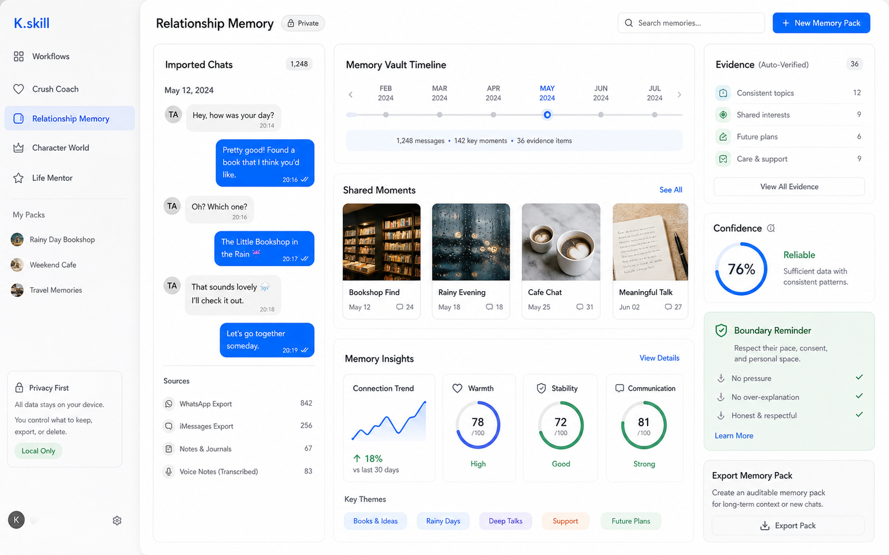

Relationship Memory는 관계 자료를 검토 가능한 장기 문맥으로 만듭니다. 공유 에피소드, 호칭 패턴, 취향, corrections, 작은 분위기까지 정리합니다.

GUI:

1. `Relationship`를 선택합니다.
2. `examples/relationship-memory-chat.txt` 또는 자신의 자료를 업로드합니다.
3. speaker, message count, language, preview lines를 확인합니다.
4. local vault에 저장합니다.
5. Prompt Stack 또는 memory state를 확인합니다.
6. 준비되면 export합니다.

CLI:

```bash
npm run cli -- init "Rain Bookstore Memory" --type relationship --language zh --out local-packs/rain-bookstore
npm run cli -- import examples/relationship-memory-chat.txt --type relationship --pack local-packs/rain-bookstore
npm run cli -- memory local-packs/rain-bookstore
npm run cli -- inspect local-packs/rain-bookstore
```

출력:

- shared memory episodes
- relationship facts and address patterns
- preferences and corrections
- tone and memory notes
- exportable persona pack files

## Character World

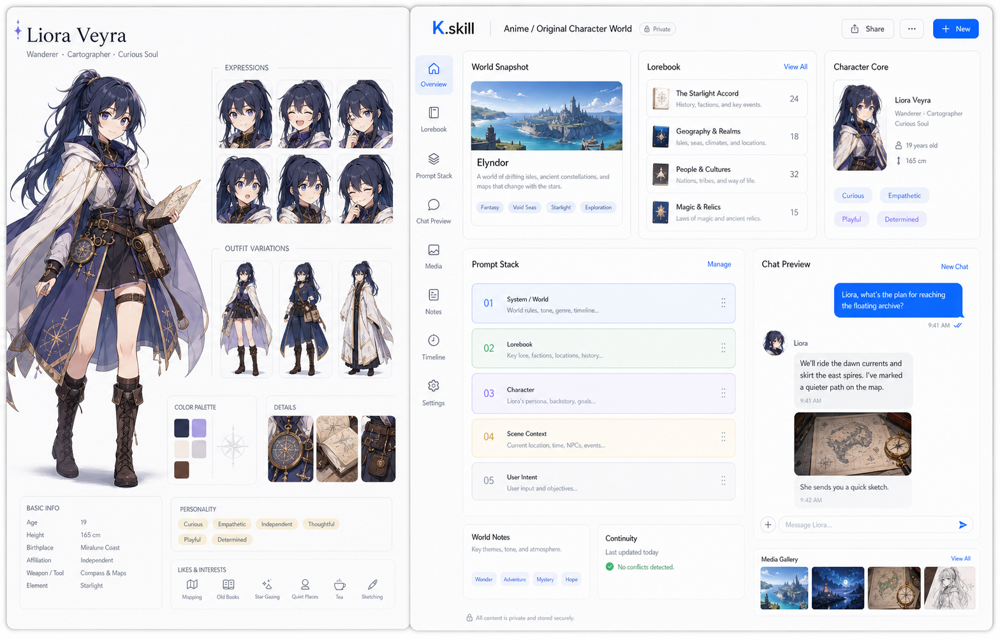

Character World는 fictional characters, original characters, anime-style OCs, worldbuilding, lorebooks, character cards를 위한 워크플로입니다. identity, world rules, memory triggers, voice rhythm을 하나의 pack으로 유지합니다.

CLI:

```bash
npm run cli -- init "Rain Archive" --type character --language zh --out local-packs/rain-archive
npm run cli -- import examples/character-world.md --type character --pack local-packs/rain-archive
npm run cli -- distill local-packs/rain-archive
npm run cli -- inspect local-packs/rain-archive
```

입력:

- original character sheets
- worldbuilding Markdown
- dialogue samples
- SillyTavern Character Card V2
- lorebook entries
- manual tone notes

출력:

- `persona.yaml`
- `persona.md`
- `memory.lorebook`
- `Prompt Stack`
- real client export bundles

## Movie Character

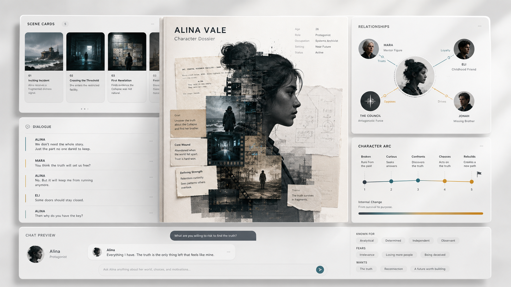

Movie Character는 Character World의 구체적 예시입니다. film-style characters, script roles, scene cards, character arcs, dialogue samples에 적합합니다. 영화 속 역할 bible의 chat 버전처럼 쓰면 됩니다.

CLI:

```bash
npm run cli -- init "Mira Vale" --type character --language en --out local-packs/mira-vale
npm run cli -- import examples/movie-character.md --type character --pack local-packs/mira-vale
npm run cli -- compile local-packs/mira-vale --target sillytavern --out local-packs/mira-vale/exports/sillytavern
npm run cli -- export-zip local-packs/mira-vale --target chatgpt --out local-packs/mira-vale/exports/chatgpt.zip
```

입력:

- script fragments
- character biography
- scene cards
- dialogue samples
- relationship map in text form
- public-domain or licensed material

출력은 character identity, arc, scene memory, voice rhythm, source notes, SillyTavern card, lorebook입니다.

## Virtual Persona

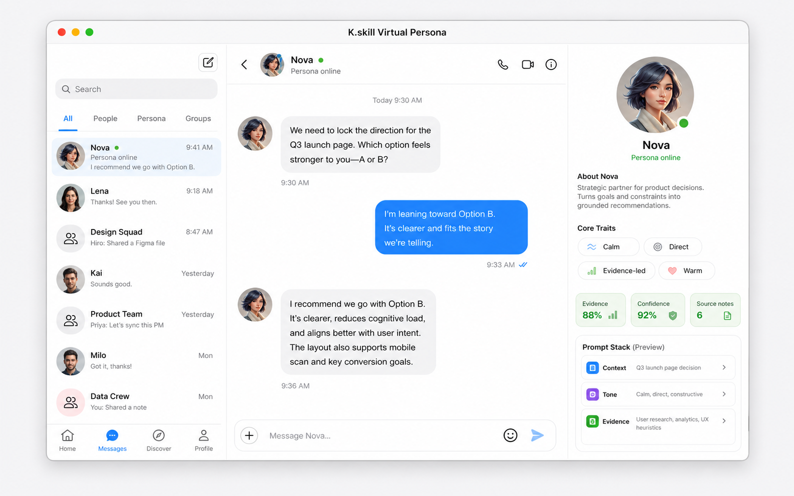

Virtual Persona는 AI companions, virtual streamer personas, game NPCs, social avatars, product characters를 자신의 brief에서 만드는 기능입니다.

GUI:

1. `Character`를 선택합니다.
2. persona brief를 업로드하거나 붙여넣습니다.
3. source preview를 확인합니다.
4. import와 distill을 실행합니다.
5. Prompt Stack에서 identity, voice, memory, rhythm을 확인합니다.
6. target client로 export합니다.

CLI:

```bash
npm run cli -- init "Nova Social" --type character --language en --out local-packs/nova-social
npm run cli -- import examples/character-world.md --type character --pack local-packs/nova-social
npm run cli -- compile local-packs/nova-social --target lobe --out local-packs/nova-social/exports/lobe
```

## Life Mentor

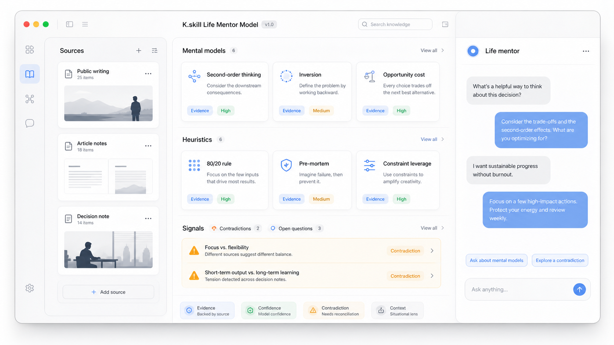

Life Mentor는 public writing, interviews, personal notes, decision records, principles를 사고 동반 모델로 바꿉니다. reasoning habits, communication style, decision patterns, tradeoffs를 모델링합니다.

CLI:

```bash
npm run cli -- init "Decision Life Mentor" --type advisor --language en --out local-packs/decision-life-mentor
npm run cli -- import examples/life-mentor-source.md --type advisor --pack local-packs/decision-life-mentor
npm run cli -- distill local-packs/decision-life-mentor
npm run cli -- inspect local-packs/decision-life-mentor
```

Life Mentor가 추출하는 것:

- expression DNA
- mental models
- heuristics
- anti-patterns
- contradictions
- evidence / confidence
- honesty notes

public figures와 celebrities는 공개 자료 기반 Life Mentor model과 잘 맞습니다. interviews, articles, launches, talks, notes를 모은 뒤 product judgment, writing, choices, tradeoffs를 물어볼 수 있습니다.

## Persona Pack

```text
persona.yaml          structured persona pack
persona.md            readable persona description
sources/              imported material
memory/               episodes, corrections, lorebook
distillation/         evidence, claims, contradictions, runs
exports/              target-specific files
```

Prompt Stack:

```text
identity       role, voice, expression DNA
mental_models  Life Mentor or character reasoning models
memory         profile facts, relationship facts, episodes
rhythm         relationship pacing, tone, reply feel, conversation texture
export layer   target platform format
```

## GUI


```bash
npm install
npm run build
npm run cli -- serve --port 5999
```

보통 `http://127.0.0.1:5999`를 엽니다.

GUI flow:

1. Crush Coach, Relationship Memory, Character World, Life Mentor를 선택합니다.
2. pack name과 language를 입력합니다.
3. upload 또는 paste.
4. consent / privacy 확인.
5. parse preview 확인.
6. Crush Coach에서 Run lab.
7. report markdown 다운로드.
8. target client zip export.

Local API:

```text
GET  /api/health
GET  /api/packs
POST /api/imports
GET  /api/voice/providers
POST /api/voice/asr
POST /api/voice/tts
POST /api/packs/:id/pastes
POST /api/packs/:id/pursuit
POST /api/packs/:id/replies
GET  /api/reports/:reportId/download
POST /api/packs/:id/exports
GET  /api/exports/:exportId/download
GET  /api/packs/:id/assets
GET  /api/packs/:id/assets/:assetId/download
GET  /api/packs/:id/memory
PATCH /api/packs/:id/memory
```

## CLI

```bash
npm run cli -- --help
npm run cli -- init "My Pack" --type relationship --language en --out local-packs/my-pack
npm run cli -- import examples/relationship-memory-chat.txt --type relationship --pack local-packs/my-pack
npm run cli -- distill local-packs/my-pack
npm run cli -- inspect local-packs/my-pack
npm run cli -- memory local-packs/my-pack
npm run cli -- eval local-packs/my-pack
```

Crush Coach:

```bash
npm run cli -- pursue examples/crush-chat-en.txt --me Me --ta TA --goal judge_chance --out tmp/pursuit-en
npm run cli -- reply examples/crush-chat-en.txt --latest "Maybe, I might go this weekend." --me Me --ta TA --style gentle
npm run cli -- topics examples/cold-chat-zh.txt --me 我 --ta TA
npm run cli -- send-or-not examples/crush-chat-en.txt --draft "Want to go together this weekend?" --latest "Maybe, I might go this weekend."
```

Export:

```bash
npm run cli -- compile local-packs/my-pack --target codex --out local-packs/my-pack/exports/codex
npm run cli -- export-zip local-packs/my-pack --target sillytavern --out local-packs/my-pack/exports/sillytavern.zip
```

## Export To Real Tools

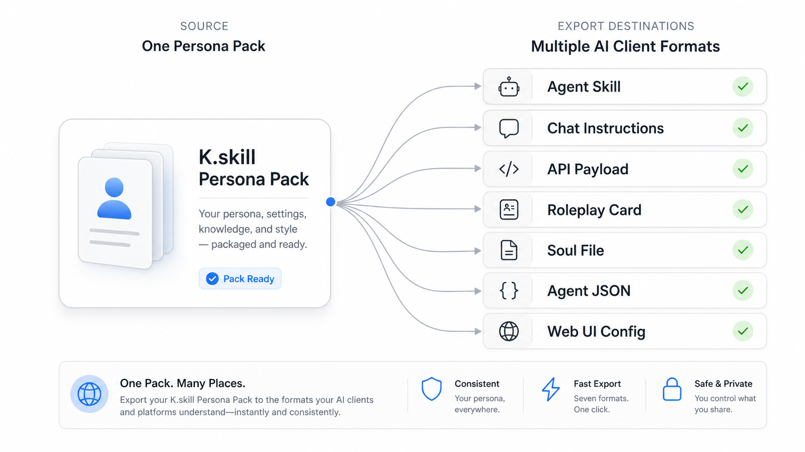

| Target | Files | How to use |
|---|---|---|
| Codex | `SKILL.md`, `references/persona.md`, `references/memory.md`, `references/evidence.json` | Codex skills path에 배치 |
| Claude | `SKILL.md`, `references/` | Claude Code skill로 설치 |
| ChatGPT | `instructions.md`, `knowledge/`, `gpt-config.json` | GPT 또는 Project에 instructions와 knowledge 업로드 |
| DeepSeek | `system-prompt.json`, `api-request.json` | system context 또는 request template로 사용 |
| SillyTavern | `character-card-v2.json`, `lorebook.json` | card와 lorebook import |
| Hermes | `SOUL.md`, `skills/` | `SOUL.md`를 primary identity로 사용 |
| LobeChat | `lobe-agent.json` | agent JSON import |
| Open WebUI | `openwebui-agent.json` | agent/model JSON import |

```bash
npm run check:exports
```

## Privacy And Feel

K.skill is local-first. Private chats stay out of Git. 외부 provider를 명시적으로 설정하지 않으면 자료는 로컬에 남습니다.

K.skill이 잘하는 일:

- chat 분위기 읽기
- relationship memory 정리
- original character 만들기
- public material을 Life Mentor로 바꾸기
- 같은 pack을 real AI tools로 export하기
- evidence와 confidence를 보이게 만들기

## Development And Verification

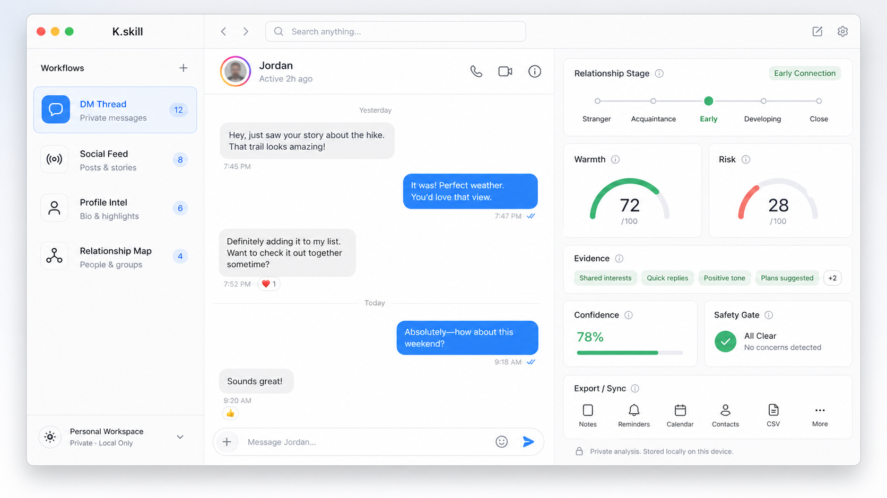

```bash
git clone https://github.com/StartripAI/K_skill.git
cd K_skill
npm install
npm run build
npm run dev
npm run cli -- --help
```

Quality gate:

```bash
npm run lint
npm test
npm run check:readme
npm run check:exports
npm run test:e2e
npm run smoke
npm run score:release
npm run verify
```

`npm run verify`는 lint, tests, build, exports, README checks, e2e, smoke, release scoring, npm pack dry-run을 실행합니다. README checks는 5개 언어, images, commands, targets, Life Mentor naming, product concepts, K.skill-only positioning을 강제합니다.

## License

Apache-2.0
